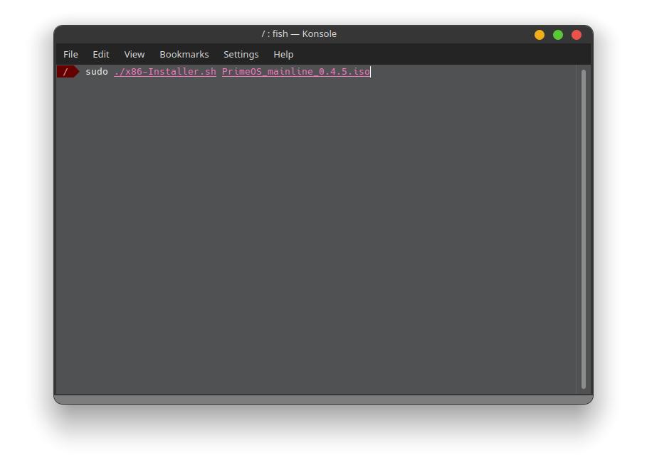
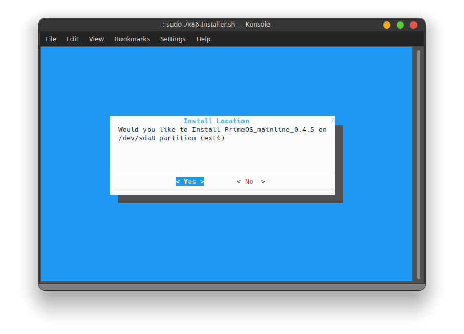
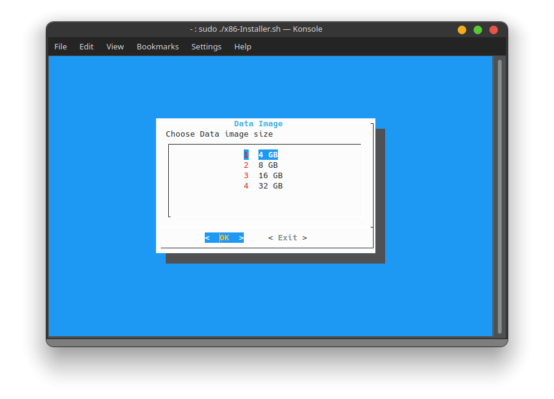

# Android x86 Installer
```
This Android x86 Installer is in development stage. You can install Android x86 OS's easily on linux with this Installer. 
If you find anything stupid in my code or you think you can implement it better than me. 
Just feel free to fork it and make pull request.
```

### Requirements
* `dialog` - for showing outputs and menus
* `dh` - To Detect partition types
* `7z` - for Extracting iso and sfs
_Other Binaries are pre-installed in your linux system_

## Usage

_Note : You must have root access to use this (sudo)_
##### Why Root?
This requires for:
* Creating data.img
* Detecting Partition
* Detecting Partition Type
* Adding GRUB Entry
* Updating Grub

<br>
## Simple UI ( uses dialog )

_It will detect the partition type and create a data.img or a data folder_
```
It will guide you through every step and you need to press the buttons to continue or cancel. Simple.
```

## Extra
You can create a file named `.include` in the same directory and add the files that you want to include when installing the OS. e.g extra kernels. <br>
_Example Content of .include file_
```
gearlock
kernel.benares
kernel1002
```
And they'll be copied to the OS Folder

## Options
`--data-create` will open up a Data creation menu where you'll be able to create data images. You will also see this menu if you are installing in other FS rather than `ext`.


